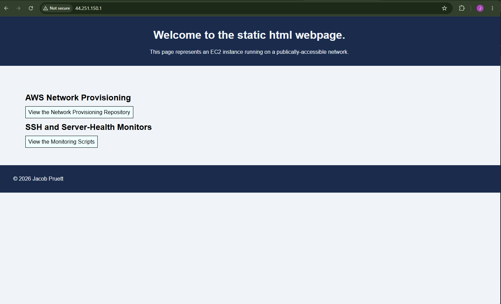

# Project Title

"aws-network-provisioning"

## Overview

Provisions a VPC network with two public subnets: one which hosts a webapp (in this version a static html page), and one
which hosts security and server-health monitoring scripts.


## Architecture / Design

Basic AWS infrastructure with VPC, two public subnets, two EC2 instances (one for each subnet), internet gateway, route
table, two security groups: one for http traffic and one for SSH traffic. Each EC2 instance is initialized from the current
version of the aws_ami. There exists separation of outputs, providers, and variables for future iterations and scalability.


## How to Run

Requirements: 
- Terraform version (v1.15.8) 
- AWS CLI installed + configured 
- AWS account with credentials, configured locally
- region: us-west-2 (see var.aws_region)


Setup:
- working AWS credentials
- terraform init (installs the AWS provider)
 
Running:
- terraform plan then terraform apply

Output:
- Running `terraform plan` shows `Plan: 11 to add` if the configuration is valid
- Running `terraform apply` and confirming with `yes` creates all 11 resources
- After apply completes, Terraform prints two public IP addresses:
  `security_vm_public_ip` — use this to SSH into the monitoring server,
  `webapp_vm_public_ip` — load this in a browser to view the static webpage


## Example Output - Deployment

Initial terraform apply failed because the default instance type wasn't Free Tier eligible on this account:

​```
Error: creating EC2 Instance: operation error EC2: RunInstances, https response error StatusCode: 400, RequestID: 6bfdf184-d974-409d-87f9-5a38cf4d43f1, api error InvalidParameterCombination: The specified instance type is not eligible for Free Tier. For a list of Free Tier instance types, run 'describe-instance-types' with the filter 'free-tier-eligible=true'.
│
│   with aws_instance.security_vm,
│   on main.tf line 157, in resource "aws_instance" "security_vm":
│  157: resource "aws_instance" "security_vm" {
│
╵
╷
│ Error: creating EC2 Instance: operation error EC2: RunInstances, https response error StatusCode: 400, RequestID: a3e43085-ad77-47b8-b887-0393aa96fdc7, api error InvalidParameterCombination: The specified instance type is not eligible for Free Tier. For a list of Free Tier instance types, run 'describe-instance-types' with the filter 'free-tier-eligible=true'.
│
│   with aws_instance.webapp_vm,
│   on main.tf line 179, in resource "aws_instance" "webapp_vm":
│  179: resource "aws_instance" "webapp_vm" {
│
​```

Checked eligible types for this account and switched `instance_type` from `t2.micro` to `t3.micro`:

​```
PS C:\Users\pruet\Desktop\Summer Project\Terraform> aws ec2 describe-instance-types --filters "Name=free-tier-eligible,Values=true" --query "InstanceTypes[].InstanceType" --output table
-----------------------
|DescribeInstanceTypes|
+---------------------+
|  t4g.small          |
|  c7i-flex.large     |
|  t3.micro           |
|  t4g.micro          |
|  m7i-flex.large     |
|  t3.small           |
+---------------------+
​```

Re-ran `terraform apply` — clean deployment:

​```
aws_instance.webapp_vm: Creating...
aws_instance.security_vm: Creating...
aws_instance.webapp_vm: Still creating... [00m10s elapsed]
aws_instance.security_vm: Still creating... [00m10s elapsed]
aws_instance.security_vm: Creation complete after 13s [id=i-0ec687ee71a68d4bc]
aws_instance.webapp_vm: Creation complete after 13s [id=i-03df5fafbe6a72266]

Apply complete! Resources: 2 added, 0 changed, 0 destroyed.

Outputs:

security_vm_public_ip = "35.94.225.227"
webapp_vm_public_ip = "44.251.150.1"
PS C:\Users\pruet\Desktop\Summer Project\Terraform>

```

## Live Webapp Deployment



## Known Limitations / Future Work
SSH capability is currently open to 0.0.0.0/0 (all IPs) rather than scoped to any specific, allowable range. Right now
this IP is defined as a variable "ssh_allowed_cidr" to enable further development and security scoping. Both EC2
instances are tied to the same availability zone. Thus, in more developed versions, these instances should be dispersed
across multiple AZs as a failsafe against the failure of any one AZ. In future versions, this project will be expanded to
include a private subnet for a database or other backend architecture.


## Author

Jacob Pruett. This project was created as part of a self-directed cloud/DevOps curriculum. 

